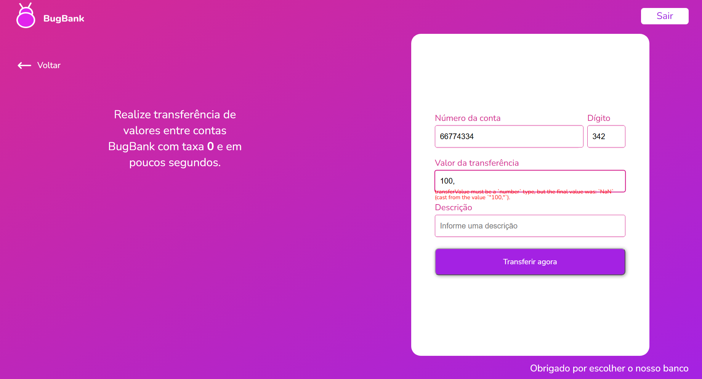
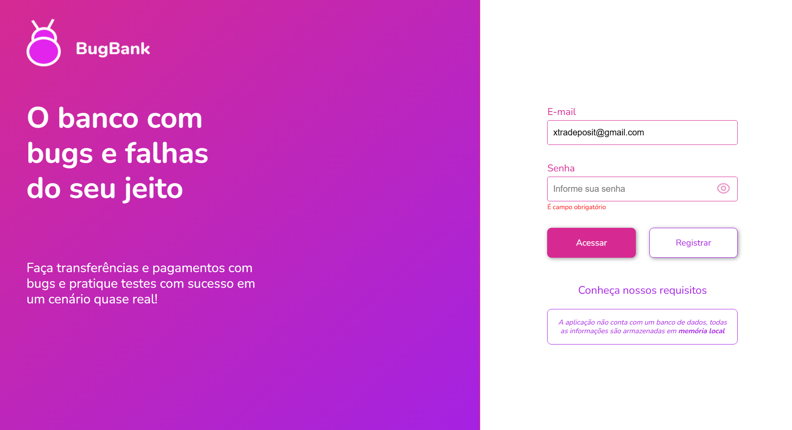

# Sessão de teste exploratório — BugBank: Cadastro, Login e Transferência

## Ficha da sessão

| Campo | Valor |
| --- | --- |
| Aplicação sob teste | BugBank (https://bugbank.netlify.app) |
| Área | Transferência entre contas (charter original), estendida a Cadastro e Login |
| Testador | Thomas Teixeira |
| Data | 22/09/2026 |
| Duração | Não cronometrada com precisão — sessão executada manualmente pela interface, sem uso de cronômetro |
| Registro | Sequencial, na ordem em que os cenários foram executados, sem marcação de horário exato por item |
| Referência | Continuação do documento [`casos-de-teste/bugbank-transferencia.md`](../casos-de-teste/bugbank-transferencia.md) |

## Metodologia

Diferente da sessão exploratória do ParaBank, o BugBank não tem nenhuma API acessível para ser chamada diretamente — é uma aplicação inteiramente client-side, sem back-end (conforme já identificado no documento de design de casos). Por isso, esta sessão foi executada manualmente, pela interface real do navegador, pelo responsável pelo projeto — não por chamadas de linha de comando. O registro e a redação deste relatório foram montados a partir da descrição dos cenários testados e dos resultados observados.

## Charter

> Confirmar, pela interface, os cenários da Transferência do BugBank que a especificação oficial não deixa claros (autotransferência, prioridade de mensagem quando mais de uma regra falha, comportamento de campos com caractere inválido ou vazios), seguindo qualquer achado relevante que surgisse durante a exploração.

## Limitação de ambiente encontrada

Uma parte relevante da aplicação estava incompleta ou instável no momento da sessão ("metade da plataforma em desenvolvimento", nas palavras do testador), o que reduziu a cobertura possível do charter original. Não foi viável, por exemplo, cadastrar um segundo cliente de teste para servir como conta de destino válida em todos os cenários planejados, o que impediu testar diretamente a autotransferência (CT-TRF-12) e os casos de conflito entre regras (CT-TRF-10/11) nesta sessão.

## Cobertura por área

| Área | Proporção aproximada da sessão |
| --- | --- |
| Configuração de sessão e investigação de login/recuperação de senha (não planejada originalmente, mas que se tornou o achado central) | 40% |
| Execução de cenários de transferência | 30% |
| Investigação e documentação de bugs | 30% |

## Notas de teste (registro sequencial)

1. **Cadastro do cliente de teste.** Cliente cadastrado com sucesso; a aplicação exibiu o número da conta criada em um modal de confirmação (conta identificada aqui como "383", para preservar o dado real). O testador observou, por conta própria, que exibir o número da conta diretamente nesse modal é uma prática questionável de exposição de dado sensível, mesmo em uma aplicação de demonstração.

2. **Tentativa de recuperar acesso ("esqueci minha senha").** Não existe nenhum botão ou fluxo de "Esqueci minha senha" na tela de login. Diante disso, o testador tentou contornar a limitação se cadastrando novamente, usando o **mesmo e-mail** da conta 383.

3. **Resultado do recadastro.** O cadastro com o e-mail já usado foi aceito sem nenhum aviso de "e-mail já cadastrado" ou conflito. Uma **nova conta, com número diferente** (identificada aqui como "545"), foi criada. Não foi testado nesta sessão se a conta 383 original ainda é acessível com a senha antiga — esse ponto fica como pergunta em aberto (ver seção correspondente abaixo). O que ficou confirmado é que o cadastro, sozinho, não impede nem avisa sobre o uso de um e-mail já existente.

4. **Tentativa de transferência para conta inexistente (número inventado).** Ao tentar transferir para um número de conta e dígito fictícios (que o testador inventou, por não ter uma segunda conta real disponível), a aplicação reprovou corretamente com a mensagem **"Conta inválida ou inexistente"** — exatamente como documentado na especificação oficial e previsto no caso `CT-TRF-07` do artefato de design. Este item **confirma** o comportamento esperado, não é um defeito.

5. **Tentativa de transferência com o campo "Valor" vazio, e depois com vírgula como separador decimal.** Ao tentar enviar o formulário de transferência sem preencher o campo "Valor", a aplicação exibiu uma mensagem técnica de validação em vez de uma mensagem de negócio. A mesma mensagem também apareceu ao digitar o valor no formato brasileiro, com vírgula (ex.: `100,`), o que foi capturado em print:

   > `transferValue must be a `number` type, but the final value was: `NaN` (cast from the value `"100,"`)`.

   

   Esse texto tem a estrutura característica de uma mensagem padrão de uma biblioteca de validação de schema (o nome do campo em inglês, o tipo de dado esperado e o valor recebido, sem tradução nem adaptação), não de uma mensagem de negócio pensada para o usuário final. O print também revela um segundo problema: o campo aceita o caractere de vírgula ao digitar, mas não sabe interpretá-la como separador decimal — não há suporte ao formato brasileiro de valor monetário.

6. **Mesma tentativa, olhando os demais campos obrigatórios.** Os outros campos que a especificação também define como obrigatórios (Número da conta, Dígito, Descrição) — quando deixados vazios e o envio é tentado — **não exibem nenhuma mensagem de erro**, diferente do campo "Valor". Não há, portanto, cobertura de validação consistente entre os campos do mesmo formulário.

7. **Problema de layout na mensagem de erro.** Quando a mensagem de erro do campo "Valor" aparece, o texto é renderizado visualmente **sobreposto ao próprio campo de entrada** (visível no print acima), dificultando a leitura tanto da mensagem quanto do conteúdo do campo.

8. **Ausência de indicação prévia de campo obrigatório.** Nenhum campo do formulário de transferência sinaliza visualmente (por exemplo, com um asterisco) que é obrigatório antes de uma tentativa de envio — a única forma de descobrir é tentando enviar o formulário incompleto. Para contraste, a tela de Login exibe corretamente "É campo obrigatório" abaixo do campo "Senha" vazio, o que reforça que o problema é específico do formulário de Transferência:

   

## Defeitos confirmados nesta sessão

1. **Recadastro com e-mail já existente cria uma conta paralela, sem validação de duplicidade, e sem um fluxo real de recuperação de acesso (severidade alta).** Relato completo em [`relatorios-de-bugs/bug-cad-001-recadastro-sem-verificar-email-duplicado.md`](../relatorios-de-bugs/bug-cad-001-recadastro-sem-verificar-email-duplicado.md).
2. **Validação do formulário de Transferência é inconsistente, com uma mensagem técnica de biblioteca vazando para o usuário e um problema de sobreposição visual (severidade média).** Relato completo em [`relatorios-de-bugs/bug-trf-001-validacao-formulario-inconsistente.md`](../relatorios-de-bugs/bug-trf-001-validacao-formulario-inconsistente.md).

## Confirmação de comportamento correto

A regra de conta de destino inválida (RN-02 do artefato de design, caso `CT-TRF-07`) foi confirmada funcionando exatamente como especificado: transferir para uma conta numericamente válida mas inexistente é reprovado com a mensagem oficial "Conta inválida ou inexistente". Vale destacar essa confirmação explicitamente — nem todo achado de uma sessão exploratória é um defeito; parte do valor da sessão é também validar o que já funciona corretamente.

## Perguntas em aberto / ideias para a próxima sessão

- A conta 383 original ainda é acessível fazendo login com o e-mail e a senha originais, depois do recadastro com o mesmo e-mail? Ou o login passa a resolver sempre para a conta mais recente (545)? Essa pergunta é o próximo passo mais importante para caracterizar completamente o impacto do defeito de recadastro.
- O que acontece de fato "nos bastidores" quando o campo "Descrição" fica vazio e o formulário é enviado: a transferência é silenciosamente bloqueada, ou é processada mesmo sem descrição (o que violaria RN-05 na prática, não só na interface)?
- Os cenários que dependiam de uma segunda conta válida (autotransferência, conflito entre duas regras violadas ao mesmo tempo) continuam pendentes, por causa da limitação de ambiente encontrada nesta sessão.
- Vale investigar se o problema de sobreposição visual da mensagem de erro (item 7) acontece em outros formulários da aplicação (Cadastro, Login) ou é específico da tela de Transferência.

## Avaliação de risco residual

O defeito de recadastro (item 1) é o mais sério identificado até aqui no BugBank: envolve controle de identidade e acesso a conta em uma aplicação bancária, mesmo que fictícia. Antes de ser considerado totalmente caracterizado, depende da confirmação da pergunta em aberto sobre a acessibilidade da conta original. O defeito de validação do formulário (item 2) é bem confirmado e reproduzível, mas de impacto mais restrito (usabilidade e qualidade de código, não integridade de dados).
